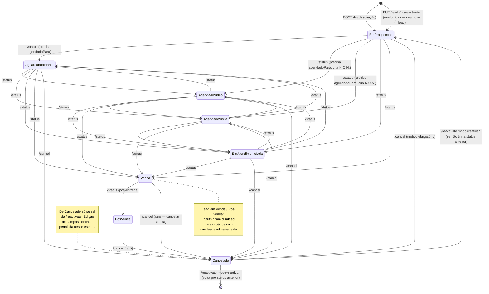
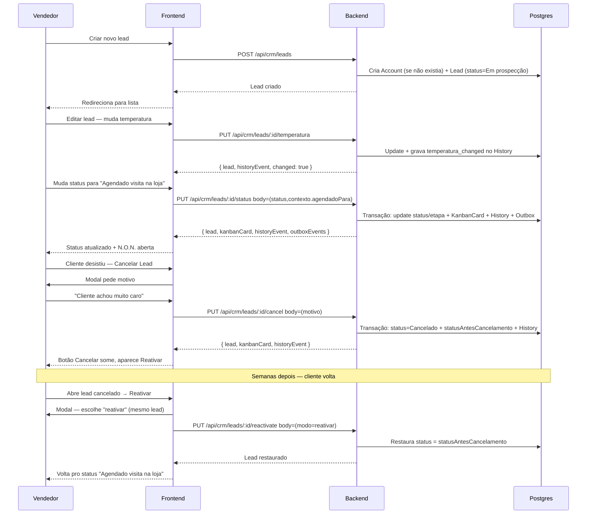

# CRM — Como o sistema funciona

> Guia de referência para entender o comportamento esperado do CRM core.
> Complementa [`crm.md`](./crm.md) (spec técnica) e [`crm-frontend.md`](./crm-frontend.md) (spec UI) com uma visão operacional.

**Versão:** 1.0.0 · **Data:** 2026-04-23

---

## 1. Conceitos fundamentais

Três entidades principais que a UI às vezes mistura — entendê-las separadamente é a chave pra debugar comportamento estranho.

| Entidade | O que é | Quem cria | Quando |
|---|---|---|---|
| **Account** (Conta) | A **pessoa** (pessoa física ou cônjuge). Identificada pelo celular. Única no sistema. | Backend, automaticamente | Ao criar o primeiro Lead daquela pessoa |
| **Lead** | Uma **oportunidade de vendas** específica vinculada a uma Account. Tem status, etapa, temperatura, vendedor. | Usuário (criação manual) ou sistema (reativação) | Explicitamente pelo form de "Novo Lead" |
| **N.O.N.** (Oportunidade de Negócio) | Um **orçamento/proposta comercial** concreto ligado a um Lead. | Botão "Nova Oportunidade" ou derivada de certas transições de status | Ao clicar no botão ou ao mudar o status para "Agendado visita na loja" / "Agendado vídeo chamada" |

**Por que isso importa:** se você cria um Lead "João", o backend cria uma Account "João" silenciosamente. Se você cria outro Lead com o mesmo celular, o backend **reutiliza** a mesma Account mas cria um novo Lead. Isso é intencional — histórico do cliente persiste entre leads.

---

## 2. Ciclo de vida do Lead (fluxograma)

### Interpretação rápida

- **Estados intermediários** (Em prospecção, Aguardando Planta, Agendados, Em Atendimento Loja) → transicionam livremente entre si e para Venda/Cancelado.
- **Venda** → só vai para Pós-venda ou Cancelado.
- **Pós-venda** → só vai para Cancelado (caso raro de devolução/desistência).
- **Cancelado** → só sai via reativação.

---

## 3. Ações disponíveis

Cada ação tem um endpoint dedicado. **Não** tente fazer tudo via `PUT /leads/:id` — esse endpoint só aceita campos de identificação (nome, cônjuge, canal, pré-vendedor).

| Ação | Endpoint | Método | Input essencial |
|---|---|---|---|
| Criar lead | `/api/crm/leads` | POST | `nome`, `celular`, `cep`, `preVendedorId` |
| Editar campos (nome, celular…) | `/api/crm/leads/:id` | PUT | Qualquer subset dos editáveis |
| **Mudar status** | `/api/crm/leads/:id/status` | PUT | `status`, opcional `motivo`, `contexto.agendadoPara` |
| Definir temperatura | `/api/crm/leads/:id/temperatura` | PUT | `temperatura` (3 valores canônicos) |
| **Cancelar lead** | `/api/crm/leads/:id/cancel` | PUT | `motivo` (obrigatório) |
| **Reativar cancelado** | `/api/crm/leads/:id/reactivate` | PUT | `modo` (reativar/novo), opcional `motivo` |
| Ler histórico | `/api/crm/leads/:id/history` | GET | opcional `cursor`, `limit` |
| Excluir (soft) | `/api/crm/leads/:id` | DELETE | — |

### Regras invioláveis

- **Status e etapa NUNCA vão no body de `PUT /leads/:id`**. O backend rejeita com 400 (Guard 1 do updateLead). Foi o bug que bloqueou edição de leads.
- **Etapa é derivada automaticamente do status** via `STATUS_TO_ETAPA`. Você nunca define etapa — ela muda sozinha quando o status muda.
- **Cancelar exige motivo** (1 a 1000 caracteres após trim). Cancelamento sem motivo é rejeitado.
- **Transicionar para Venda/Pós-venda/Cancelado não pode ser desfeito casualmente**: Venda→Pós-venda é unidirecional (via /status); Cancelado só sai via /reactivate.

---

## 4. Temperatura

Valor emocional que o pré-vendedor atribui ao lead. 3 valores canônicos:

- **Muito interessado** (chip vermelho — Flame) → lead quente
- **Interessado** (chip âmbar — ThermometerSun) → lead morno
- **Sem interesse** (chip azul — Snowflake) → lead frio

### Comportamento:

- Na criação, temperatura é `null` (nenhum selecionado).
- Mudança gera evento `temperatura_changed` no histórico com `{ from, to }`.
- Se você clicar no valor atual, não faz nada (backend retorna `changed: false`, UI silencia).
- Leads cancelados e pós-venda sem permissão têm o picker desabilitado.

---

## 5. Side effects das transições

Quando o status muda, o backend dispara efeitos colaterais. Você NÃO precisa orquestrar nada — a transição simples dispara tudo atomicamente.

| Status destino | Side effects automáticos |
|---|---|
| Em prospecção | Nenhum (estado inicial) |
| Aguardando Planta/medidas | Abre agenda `coleta_planta_medidas` |
| **Agendado vídeo chamada** | Abre agenda `video_chamada` **+ abre/cria N.O.N.** |
| **Agendado visita na loja** | Abre agenda `visita_loja` **+ abre/cria N.O.N.** |
| Em Atendimento Loja | Nenhum extra |
| Venda | Nenhum extra (N.O.N. já existente permanece) |
| Pós-venda | Nenhum extra |
| Cancelado | Preenche `statusAntesCancelamento` + `canceladoEm` |

### Efeitos sempre-ligados (toda transição):

- Move o `KanbanCard` do lead pra coluna da nova etapa.
- Registra evento `status_changed` no `LeadHistory` com `{ from, to }`.
- Atualiza o campo `etapa` do Lead via `STATUS_TO_ETAPA`.
- Enfileira eventos no `Outbox` pra integrações externas (n8n, Agenda Google).

---

## 6. Cancelamento e reativação

### Cancelar

Fluxo UI: clica em "Cancelar Lead" → abre `CancelLeadDialog` → preenche motivo (obrigatório) → submit → vira Cancelado.

O que acontece no backend:

1. Valida que status atual não é Cancelado
2. Grava `statusAntesCancelamento = status atual`
3. Grava `canceladoEm = now()`
4. Muda status para `Cancelado`
5. Registra evento `lead_cancelled` com `{ reason }`
6. Move KanbanCard pra coluna "Cancelados"
7. Enfileira outbox event `lead_cancelled`

### Reativar

Só disponível quando o lead está em Cancelado. Dois modos:

**Modo "reativar"**
- Restaura o próprio Lead
- Status volta pra `statusAntesCancelamento` (ou "Em prospecção" se não tinha)
- Preserva histórico, vínculos, temperatura
- Evento: `lead_reactivated`

**Modo "novo"**
- Preserva o Lead cancelado (fica como registro histórico)
- Cria um **novo Lead** no mesmo Account, começando em "Em prospecção"
- Evento `reactivated_as_new_lead` no lead antigo, `created_from_reactivation` no novo
- UI redireciona automaticamente pra edição do novo lead

Use "reativar" quando o cliente voltou e o contexto é o mesmo. Use "novo" quando é uma oportunidade totalmente diferente (mudou de ideia sobre o imóvel, outro segmento, etc.).

---

## 7. Bloqueio pós-venda

Quando o lead está em **Venda** ou **Pós-venda**, a UI muda:

- Banner amarelo no topo avisando "Edição bloqueada"
- Todos os inputs do form (nome, celular, cônjuge, canal, pré-vendedor) ficam disabled
- Botão "Salvar Alterações" também disabled
- LeadStatusDropdown ainda clicável (permite ir pra Pós-venda ou Cancelado) — mas só se o usuário tiver a permissão
- TemperaturaPicker disabled

**Exceção:** usuários com permissão `crm:leads:edit-after-sale` continuam conseguindo editar tudo. ADMs sempre têm acesso (via wildcard `*`).

Por que existe essa trava: spec §9.14. Um lead vendido já gerou contrato; mudar nome, celular, etc. depois da venda corrompe auditoria e contabilidade. Só admin (com permissão específica) pode corrigir erros.

---

## 8. Histórico (LeadHistory)

Cada ação no lead gera um evento imutável no histórico. É append-only — nunca é atualizado nem deletado.

### 12 tipos de evento:

| Tipo | Quando dispara |
|---|---|
| `status_changed` | Transição de status |
| `temperatura_changed` | Mudança de temperatura |
| `vendedor_transferred` | Troca de vendedor |
| `prevendedor_transferred` | Troca de pré-vendedor |
| `agenda_scheduled` | Agendamento disparado (vídeo, visita, coleta) |
| `non_generated` | N.O.N. criada a partir do lead |
| `lead_cancelled` | Cancelamento |
| `lead_reactivated` | Reativação modo "reativar" |
| `reactivated_as_new_lead` | Reativação modo "novo" — no lead original |
| `created_from_reactivation` | Reativação modo "novo" — no novo lead |
| `note_added` | Nota manual (feature futura) |
| `external_created` | Lead criado via n8n/webhook/formulário |

A timeline na UI ordena por data desc (mais recente primeiro). Primeiros 20 eventos vêm junto com `GET /leads/:id`; paginação via cursor no botão "Ver mais".

---

## 9. Pontos de confusão comuns

### "Criei um lead e automaticamente apareceu uma N.O.N."

**Conhecido.** Task dedicado separado para refatorar. Acontece porque alguns endpoints de listagem (como `/api/crm/orcamentos`) retornam Leads como se fossem N.O.N. — sobreposição conceitual antiga. Spec `crm.md` §11 detalha. O backend já separou entidades; a UI de listagem é que ainda mistura.

### "Mudei o status via form genérico e deu 400"

Esperado. Status só muda via `PUT /leads/:id/status` (LeadStatusDropdown). Tentar via `PUT /leads/:id` com campo `status` no body dispara Guard 1 (bloqueia com 400). A UI nova não deixa isso acontecer — mas usuários com browser em cache podem cair nisso até atualizar.

### "Tentei cancelar sem motivo"

Backend rejeita. `cancelLeadSchema` exige `motivo` com min 1 char após trim. UI também bloqueia o submit até o motivo estar preenchido.

### "Reativei um lead e ele foi pra 'Em prospecção' em vez do status anterior"

Isso acontece se o `statusAntesCancelamento` estiver null — normalmente acontece com leads muito antigos do sistema legado que foram migrados como cancelados. Para leads novos, sempre volta pro status anterior.

### "Não vejo opção X no dropdown de status"

`getValidTransitions(statusAtual)` filtra por transições válidas:
- De Venda: só aparece Pós-venda
- De Pós-venda: nenhuma (só via /cancel)
- De Cancelado: nenhuma (só via /reactivate)
- De intermediários: todos exceto si mesmo, Pós-venda (precisa passar por Venda), e Cancelado (precisa ir via /cancel)

Se o dropdown mostra "Nenhuma transição disponível", é esperado para estados terminais.

### "Temperatura/inputs bloqueados em leads vendidos"

Intencional. Só ADM ou usuário com `crm:leads:edit-after-sale` edita.

---

## 10. Fluxo típico do vendedor (caso de uso)

---

## 11. Validações por camada

| Camada | O que valida |
|---|---|
| **Frontend (form)** | `validateLeadForm` — nome, celular min 10 dígitos, CEP 8 dígitos |
| **Validator (Zod)** | `createLeadSchema`, `transitionStatusSchema`, `cancelLeadSchema`, `reactivateLeadSchema`, `temperaturaSchema` |
| **Service (guards)** | Guard 1 (updateLead bloqueia status/etapa), Guard 2 (post-sale permission), Guard 3 (terminal status edits), state machine transitions |
| **Database** | Unique constraints (Account.celular), NOT NULL (motivo em cancelamento via schema) |

Se algo foi rejeitado com 400, a mensagem vem do Zod (camada mais próxima do usuário). 403 vem dos guards de service. 409 vem de conflito (lock do Redis ou versão obsoleta).

---

## 12. Permissões relevantes

| Permissão | Ação |
|---|---|
| `crm:leads:create` | Criar lead novo |
| `crm:leads:update` | Editar campos do lead (PUT /leads/:id) |
| `crm:leads:read:all` | Ver leads de qualquer filial |
| `crm:leads:read:branch` | Ver leads só da sua filial |
| `crm:leads:edit-after-sale` | Editar leads em Venda/Pós-venda |
| `crm:leads:reactivate` | Reativar leads cancelados |
| `crm:leads:transfer` | Transferir leads pra outro vendedor |

Usuários com role `ADM` / `admin` / `Administrador` ou permissões contendo `*` têm acesso total.

---

## 13. Quando algo dá errado

### O lead não salva (botão verde não responde)

Primeiro: browser em cache com JS velho? Ctrl+Shift+R força reload. Se persistir, ver Network tab → procurar o PUT → olhar o response body.

Se der 400 com "Mudança de status/etapa não é permitida": frontend está mandando campo proibido. Verificar payload no Network; deve ter só nome/celular/cônjuge/canal/pré-vendedor.

Se der 403: permissão. Verifica role do usuário.

### A temperatura não sobe quando clico

Se o lead está em Venda/Pós-venda sem permissão → picker disabled. Se está em Cancelado → picker disabled. Se está em estado normal e não funciona → bug; abrir Console e ver erro JS.

### O status não muda

Geralmente: tentei aplicar transição inválida. Modal só mostra válidas, mas se você conseguiu enviar, backend rejeita com 400.
Secundário: conflito de versão (409) — alguém editou o lead no mesmo instante. Recarregar a tela.

### Cancelei e não consigo reativar

Verifica: o lead está em Cancelado mesmo? Se está, o botão "Reativar" deve aparecer no cabeçalho. Se não aparece → UI precisa rerender (recarrega a página).

### Reativei modo "novo" mas não fui pro novo lead

Bug se acontece — o redirect é automático se `res.leadNovo.id` veio na resposta. Verificar Network response body.

### N.O.N. apareceu sem eu ter pedido

Transição para `Agendado vídeo chamada` ou `Agendado visita na loja` cria N.O.N. automaticamente. Intencional. Se criou em outro contexto (ex: ao cadastrar lead), é o bug conhecido da listagem de N.O.N. — não está criando de verdade, está listando o Lead como se fosse N.O.N.

---

## 14. Próximos passos (o que ainda não tem)

- **Transferência de lead** via UI dedicada (backend existe, UI não)
- **Notas manuais** no histórico (NOTE_ADDED ainda não tem UI)
- **Dashboard de conversão** por etapa/vendedor
- **N.O.N. separada** de Lead na listagem (Task em backlog)
- **E2E automatizado** via Playwright (zero testes hoje)
- **Auditoria completa** — quem editou o quê (além do histórico de eventos)

---

## 15. Para debugar

1. **Abrir DevTools → Network** → refazer a ação → olhar o request/response
2. **Verificar permissões do usuário**: `console.log(user.permissions)` no browser ou `SELECT permissions FROM "Role" WHERE id = ...` no DB
3. **Ver histórico real**: `GET /api/crm/leads/:id/history` — o que o sistema registrou
4. **Ver estado do lead**: `GET /api/crm/leads/:id` — shape completo
5. **Logs do backend**: `docker logs crm-backend-stg --tail 100 -f` no VPS
6. **Logs do frontend** (SSR): `docker logs crm-frontend-stg --tail 100 -f`
