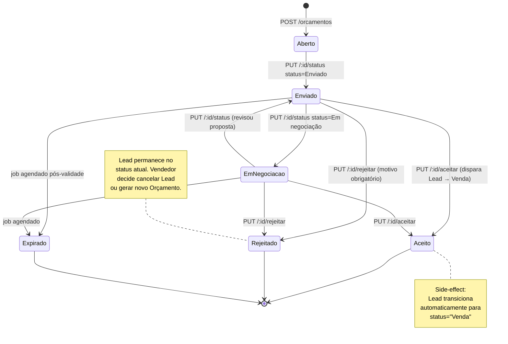

# Spec Técnica: Entidade Orçamento / N.O.N.

**Escopo:** separar a entidade "Oportunidade de Negócio" (Orçamento) do `Lead`, criando tabela própria com ciclo de vida independente.
**Complementa:** [`crm.md`](./crm.md) §1 (modelo de dados), §7 (state machine), §4 (endpoints).
**Versão:** 1.0.0 · **Data:** 2026-04-23

---

## 1. Motivação

O schema atual tem **uma única tabela `Lead`**, mas a UI apresenta duas telas distintas (Leads e Oportunidades) consumindo a mesma tabela. Consequências:

- Criar um Lead faz com que ele apareça na listagem de Oportunidades (bug percebido pelo usuário).
- Não há como representar o ciclo de vida de uma proposta comercial separado do pipeline de leads.
- "Botão Nova Oportunidade" hoje só redireciona pra outra tela da mesma entidade.

A solução é introduzir a entidade `Orcamento` (também chamada N.O.N. — Nova Oportunidade de Negócio) com responsabilidade clara: representar uma proposta comercial concreta feita a um Lead.

---

## 2. Modelo de domínio

```
Account (cliente — pessoa física)
  ↓ 1-N
Lead (intenção de compra; status, temperatura, vendedor)
  ↓ 1-1 ativa  ← NOVA RELAÇÃO
Orcamento (proposta comercial; status, valor, validade)
```

### Restrições fundamentais

- **1 Lead pode ter no máximo 1 Orçamento ATIVO** (status ∈ {Aberto, Enviado, Em negociação}).
- Orçamentos em estados terminais (Aceito, Rejeitado, Expirado) **não bloqueiam** a criação de um novo — ficam como histórico do Lead.
- **Todo Orçamento pertence a exatamente um Lead**. Não existe Orçamento órfão.
- Um Account pode ter vários Leads, cada um com seu próprio Orçamento ativo.

---

## 3. Entidade `Orcamento`

### 3.1 Campos

| Campo | Tipo | Obrigatório | Descrição |
|---|---|---|---|
| `id` | Int (PK auto) | ✓ | Identificador |
| `numero` | String (UNIQUE) | ✓ | Número visível da proposta (ex: `NON-2026-000123`). Gerado pelo backend no create. |
| `leadId` | Int (FK Lead) | ✓ | Lead de origem |
| `status` | String | ✓ | Ver §4 (estados) — default `'Aberto'` |
| `valorTotal` | Decimal(12,2) | — | Valor total da proposta |
| `validade` | DateTime | — | Data limite pra aceite |
| `condicaoPagamento` | String | — | Ex: "À vista", "30/60/90", etc. Texto livre por enquanto |
| `observacoes` | Text | — | Notas livres do vendedor |
| `motivoRejeicao` | String | — | Preenchido ao transicionar pra Rejeitado |
| `aceitoEm` | DateTime | — | Timestamp de aceite |
| `rejeitadoEm` | DateTime | — | Timestamp de rejeição |
| `expiradoEm` | DateTime | — | Timestamp quando transicionou pra Expirado |
| `criadoPorUserId` | Int (FK User) | ✓ | Quem criou |
| `createdAt` | DateTime | ✓ | Auto |
| `updatedAt` | DateTime | ✓ | Auto |
| `deletedAt` | DateTime | — | Soft-delete |

**Fora de escopo desta versão** (campos pra sprint futuro):
- Items de orçamento (linhas de produtos/quantidade/preço)
- Desconto/acréscimo
- Forma de pagamento estruturada
- Arquivos anexos (PDF da proposta, etc.)

### 3.2 Constraint de unicidade

```sql
-- Apenas um Orçamento ATIVO por Lead (enforced via partial unique index)
CREATE UNIQUE INDEX orcamento_lead_ativo
  ON "Orcamento" ("leadId")
  WHERE status IN ('Aberto', 'Enviado', 'Em negociação') AND "deletedAt" IS NULL;
```

Isso permite múltiplos Orçamentos terminais pro mesmo Lead (histórico) mas bloqueia criar um segundo ativo.

### 3.3 Numeração

Formato: `NON-{YYYY}-{SEQ:06}`.
- `YYYY` — ano da criação.
- `SEQ` — sequencial global iniciando em `000001` por ano. Reset anual.
- Geração via sequence no Postgres ou service lock pra garantir atomicidade.

Exemplo: `NON-2026-000042`.

---

## 4. Máquina de estados do Orçamento



### 4.1 Estados canônicos

- **Aberto** — criado mas ainda não enviado ao cliente (rascunho).
- **Enviado** — proposta apresentada ao cliente.
- **Em negociação** — cliente respondeu, negociação em curso.
- **Aceito** — cliente fechou. Terminal.
- **Rejeitado** — cliente recusou. Terminal.
- **Expirado** — passou da `validade` sem aceite. Terminal.

### 4.2 Transições permitidas

| De | Para | Como |
|---|---|---|
| Aberto | Enviado | Endpoint `/status` |
| Enviado | Em negociação | Endpoint `/status` |
| Em negociação | Enviado | Endpoint `/status` (revisão) |
| Enviado / Em negociação | Aceito | Endpoint dedicado `/aceitar` |
| Enviado / Em negociação | Rejeitado | Endpoint dedicado `/rejeitar` (motivo obrigatório) |
| Enviado / Em negociação | Expirado | Job de fundo (automático) |
| Terminal (Aceito/Rejeitado/Expirado) | qualquer | **Bloqueado** (imutável) |

### 4.3 Reabrir Orçamento terminal

**Não suportado.** Para renegociar, o vendedor cria um novo Orçamento no mesmo Lead (permitido se o anterior está em estado terminal).

---

## 5. Interação com o Lead

### 5.1 Side-effects Lead → Orçamento

| Transição do Lead | Efeito no Orçamento |
|---|---|
| `→ Agendado vídeo chamada` | Cria Orçamento em `Aberto` (se não existir ativo) |
| `→ Agendado visita na loja` | Cria Orçamento em `Aberto` (se não existir ativo) |
| `→ Cancelado` (via /cancel) | Marca Orçamento ativo como `Rejeitado` com motivo = `"Lead cancelado: {motivoDoLead}"` |
| `→ Venda` (via /status, manual) | **NÃO cria** Orçamento. Operador deveria aceitar Orçamento (que causa esse status). Caso haja Orçamento ativo sem aceite prévio, flag warning no log. |
| Outras transições | Nenhum efeito |

Essas regras consolidam o atual `NON_OPEN_OR_CREATE` do `statusMachine.js`.

### 5.2 Side-effects Orçamento → Lead

| Transição do Orçamento | Efeito no Lead |
|---|---|
| `→ Aceito` | Lead transiciona pra `Venda` automaticamente (via leadTransitionService). Gera evento `status_changed` no LeadHistory. |
| `→ Rejeitado` | Nenhum efeito automático. Vendedor decide. |
| `→ Expirado` | Nenhum efeito automático. |

### 5.3 Botão "Nova Oportunidade" na UI

Clicar no botão chama `POST /api/crm/orcamentos` com `{ leadId }`. Backend:

1. Verifica que não existe Orçamento ativo pro Lead (senão 409 com link pro existente).
2. Cria Orçamento em `Aberto` com `criadoPorUserId = req.user.id`.
3. Gera `numero` sequencial.
4. Registra evento `non_generated` no LeadHistory.
5. Retorna 201 com o Orçamento.

---

## 6. Endpoints

### 6.1 Listagem
- `GET /api/crm/orcamentos` — lista Orçamentos (filtros: status, leadId, userId, período).
- `GET /api/crm/orcamentos/:id` — detalhe com include Lead + Account.
- `GET /api/crm/leads/:id/orcamento` — Orçamento ATIVO do lead (404 se não houver). Shortcut pra UI.

### 6.2 CRUD
- `POST /api/crm/orcamentos` body=`{ leadId }` → cria em `Aberto`.
- `PUT /api/crm/orcamentos/:id` body=`{ valorTotal?, validade?, condicaoPagamento?, observacoes? }` → atualiza campos editáveis. Bloqueado se status ∈ terminal.
- `DELETE /api/crm/orcamentos/:id` → soft-delete. Bloqueado se status = Aceito (auditoria).

### 6.3 Transições
- `PUT /api/crm/orcamentos/:id/status` body=`{ status }` → transições simples (Aberto↔Enviado↔Em negociação).
- `PUT /api/crm/orcamentos/:id/aceitar` body=`{}` → aceita + dispara Lead → Venda.
- `PUT /api/crm/orcamentos/:id/rejeitar` body=`{ motivo }` → rejeita com motivo obrigatório.

### 6.4 Permissões

| Ação | Permissão requerida |
|---|---|
| Listar / ver | `crm:orcamentos:read` |
| Criar | `crm:orcamentos:create` |
| Editar campos | `crm:orcamentos:update` |
| Transicionar status | `crm:orcamentos:update` |
| Aceitar/Rejeitar | `crm:orcamentos:update` |
| Deletar | `crm:orcamentos:delete` (ADM apenas) |

Todas herdam escopo de filial via o `filialId` do Lead associado.

---

## 7. Histórico

Orçamento **não tem histórico próprio** nesta versão — eventos relevantes aparecem no `LeadHistory` do Lead associado:

- `non_generated` — criação do Orçamento (já existe)
- `non_sent` — transição para Enviado (novo)
- `non_accepted` — Orçamento aceito (novo)
- `non_rejected` — Orçamento rejeitado (novo)
- `non_expired` — Orçamento expirou (novo)

Payload de cada evento inclui `orcamentoId` e `numero` pra rastreamento.

Histórico dedicado do Orçamento fica pra sprint futuro quando houver demanda por auditoria granular das mudanças de valor/condição.

---

## 8. Expiração automática

Job de fundo (cron) roda 1x/dia marcando como `Expirado` os Orçamentos:
- Status ∈ {Enviado, Em negociação}
- `validade` não nula e `validade < now()`

Implementação via `node-cron` no backend, função `expireOrcamentos()` em `jobs/orcamentoExpiration.js`. Desabilitado em testes.

Registra evento `non_expired` no LeadHistory pra cada Orçamento expirado.

---

## 9. Migração de dados

### 9.1 Dados existentes

Conforme decisão do usuário (sessão 2026-04-23): **todos os Leads existentes continuam sem Orçamento**. A tabela `Orcamento` começa vazia.

Consequência: quem quiser criar proposta nos leads legados precisa clicar manualmente em "Nova Oportunidade".

### 9.2 Steps

1. Criar tabela `Orcamento` via `prisma db push` (staging) / `prisma migrate deploy` (prod).
2. Refatorar `crmService.getAllOrcamentos` pra consultar a nova tabela em vez de `prisma.lead.findMany`.
3. Adicionar redirect/warning em endpoints antigos que ainda confundiam as entidades.

### 9.3 Rollback

Se necessário: reverter o commit e rodar `DROP TABLE "Orcamento" CASCADE`. Não há dados migrados pra restaurar.

---

## 10. Guards e validações

### 10.1 Validators (Zod)

- `createOrcamentoSchema` — `leadId: int positive`.
- `updateOrcamentoSchema` — subset de `{ valorTotal: decimal, validade: ISO datetime, condicaoPagamento: string<500, observacoes: string<5000 }`.
- `transitionOrcamentoStatusSchema` — `status ∈ {Aberto, Enviado, "Em negociação"}` (terminais têm endpoints dedicados).
- `rejectOrcamentoSchema` — `motivo: string 1-1000 trim`.

### 10.2 Service guards

1. **Guard anti-duplicação**: `createOrcamento` verifica constraint antes de criar (dá erro mais amigável que unique violation).
2. **Guard terminal**: tentativa de editar/transicionar Orçamento terminal retorna 409 "Orçamento em estado terminal, não pode ser modificado".
3. **Guard scope**: usuário sem permissão vê 403.
4. **Guard Lead state**: não pode criar Orçamento em Lead Cancelado (retorna 409 "Reative o Lead antes").

---

## 11. UI — pontos de mudança

1. Botão "Nova Oportunidade" em `/crm/leads/[id]`:
   - Antes: redireciona pra tela de N.O.N.
   - Depois: chama `POST /orcamentos` diretamente; ao sucesso redireciona pra `/crm/orcamentos/{novoId}`.

2. Tela `/crm/oportunidade-de-negocio`:
   - Lista orçamentos reais (não mais Leads).
   - Cada linha mostra `numero`, Lead vinculado, status, valor, validade.

3. Tela nova `/crm/orcamentos/[id]`:
   - Campos editáveis (valor, validade, condição, observações).
   - Botões de transição: Enviar, Marcar em Negociação, Aceitar, Rejeitar.
   - Link pro Lead.
   - Histórico de eventos relevantes.

4. Na edição do Lead, mostrar badge do Orçamento ativo (se houver):
   - "Orçamento NON-2026-00042 em Enviado · R$ 18.500,00"
   - Click abre o Orçamento.

---

## 12. Pontos fora de escopo (desta versão)

- Items detalhados do Orçamento (produtos/quantidades).
- Geração de PDF / upload de anexos.
- Notificação automática (WhatsApp/Email) ao transicionar para Enviado.
- Comissão calculada no aceite.
- Meta de conversão por vendedor.
- UI de Kanban específico de Orçamentos.

Esses ficam pra iterações futuras após validação do core.

---

## 13. Definition of Done

- [ ] Tabela `Orcamento` criada no schema e aplicada em staging + prod
- [ ] Endpoints listados em §6 implementados com Zod + guards
- [ ] State machine do Orçamento com testes unitários
- [ ] Refactor de `getAllOrcamentos` pra não mais consumir tabela Lead
- [ ] Side-effects Lead ↔ Orçamento implementados (5 regras em §5.1 + §5.2)
- [ ] Job de expiração rodando em staging
- [ ] UI nova (`/crm/orcamentos/[id]`) implementada
- [ ] Botão "Nova Oportunidade" do Lead cria Orçamento de verdade
- [ ] Backfill de permissões (`crm:orcamentos:*`) rodado
- [ ] Teste E2E manual: criar Lead → não aparece em /orcamentos → clica Nova Oportunidade → aparece → aceita → Lead vira Venda
- [ ] Sem regressão nos testes do Lead core (≥ 363 passing no backend)
